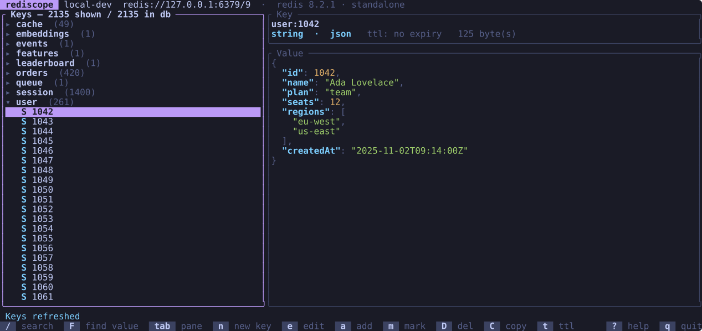
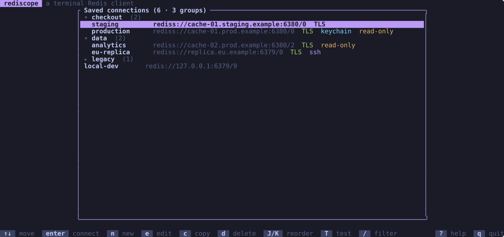
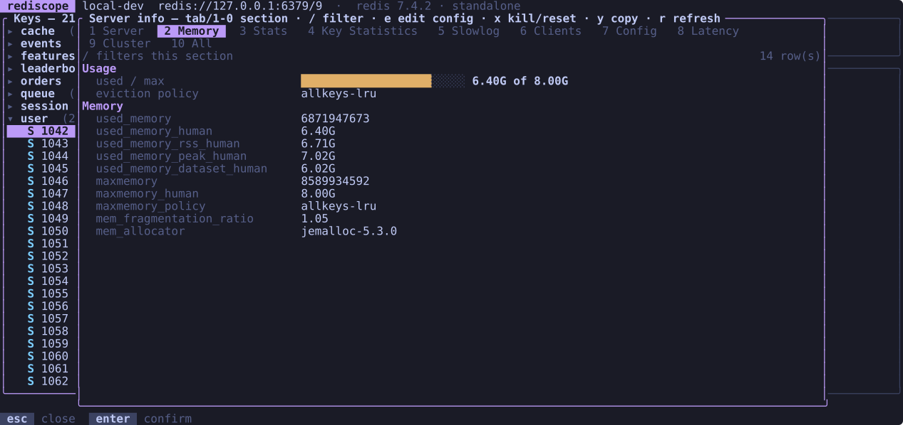
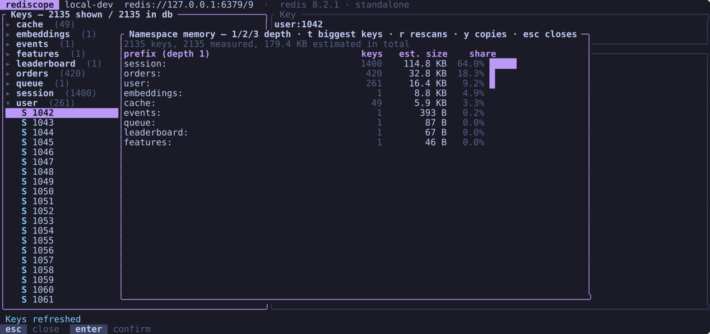
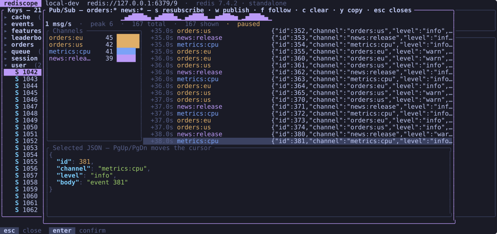
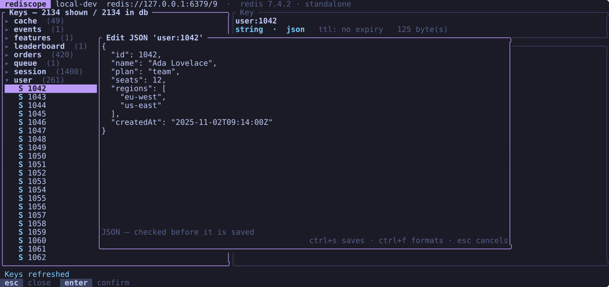
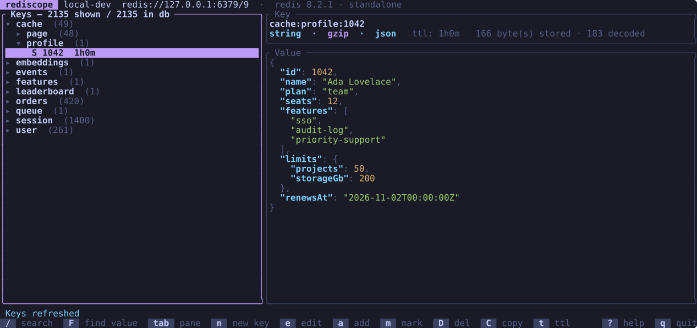
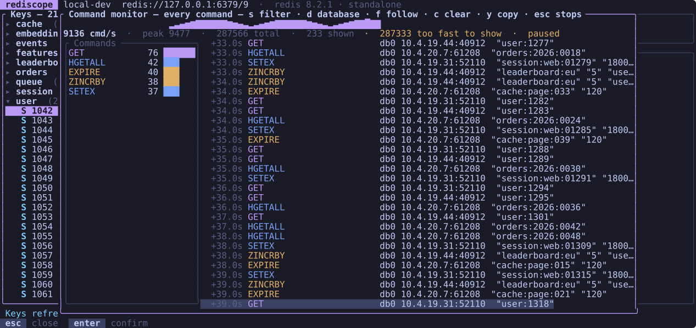
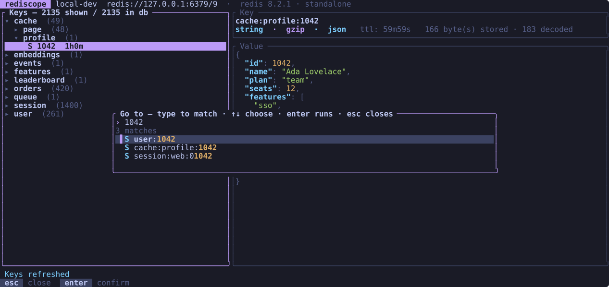
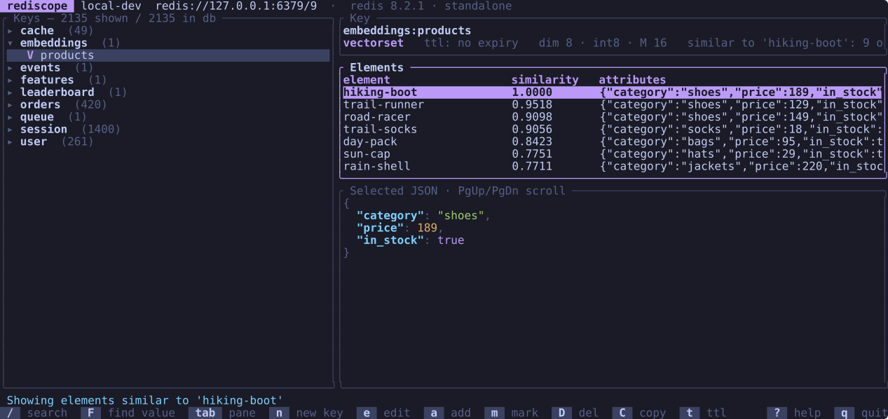

# rediscope

A terminal UI Redis client. Browse the keyspace as a folder tree, read and edit
every value type (Redis 8 vector sets included), watch TTLs count down, find out
which prefix is eating your RAM, and drop into a raw command console. It works
with Redis, Valkey, KeyDB and Dragonfly. One static binary, no Electron and no
Python runtime.

| Key browser | Server list |
|---|---|
|  |  |
| **Server info** | **Namespace memory** |
|  |  |
| **Pub/Sub feed** | **Value editor** |
|  |  |
| **Compressed values** | **Command monitor** |
|  |  |
| **Go to anything** | **Vector sets** |
|  |  |

**[taraskovalenko.github.io/Rediscope](https://taraskovalenko.github.io/Rediscope/)** — install commands, every screen, and the keys worth knowing.

**Contents:** [Install](#install) · [Quick start](#quick-start) ·
[Features](#features) · [Compatibility](#compatibility) · [Keybindings](#keybindings) ·
[Command line](#command-line) · [Connections and secrets](#connections-and-secrets) ·
[Configuration](#configuration) · [Troubleshooting](#troubleshooting) ·
[Development](#development)

## Install

macOS and Linux:

```sh
curl -fsSL https://raw.githubusercontent.com/TarasKovalenko/Rediscope/main/install.sh | sh
```

Windows (PowerShell):

```powershell
irm https://raw.githubusercontent.com/TarasKovalenko/Rediscope/main/install.ps1 | iex
```

Either script detects your platform, downloads the matching prebuilt binary from
GitHub Releases, verifies its SHA-256 against the published `SHA256SUMS`, verifies
the release's signed build provenance with the GitHub CLI, and installs to
`~/.local/bin` (`/usr/local/bin` when run as root), or on Windows to
`%LOCALAPPDATA%\Programs\rediscope\bin`, adding it to your user `PATH`.

Verification needs `gh` on your `PATH`, and only releases built after provenance
existed carry an attestation. The default, `REDISCOPE_VERIFY_PROVENANCE=auto`,
tells those cases apart so nothing has to be configured:

| Situation | What happens |
|---|---|
| Release is signed and verifies | Installs |
| Release is signed and does **not** verify | Refuses, always — in every mode |
| Release predates provenance (v0.9.0 and earlier) | Warns, asks at the terminal, installs on `y` |
| `gh` missing, or GitHub unreachable | Warns, asks at the terminal, installs on `y` |

With no terminal to ask on — a CI job, a Dockerfile — the last two cases warn and
continue on the checksum alone. Set `REDISCOPE_VERIFY_PROVENANCE=1` to make them
fatal instead and require a verified attestation, or `0` to skip the check.
A signature that fails to verify is never waved through by any setting.

Pin a version or change the location:

```sh
REDISCOPE_VERSION=v0.8.0 REDISCOPE_BIN_DIR=/usr/local/bin \
  curl -fsSL https://raw.githubusercontent.com/TarasKovalenko/Rediscope/main/install.sh | sh
```

```powershell
$env:REDISCOPE_VERSION = 'v0.8.0'
$env:REDISCOPE_BIN_DIR = 'C:\tools\bin'
irm https://raw.githubusercontent.com/TarasKovalenko/Rediscope/main/install.ps1 | iex
```

If you'd rather not pipe a script into a shell, download the archive for your
platform from the [releases page](https://github.com/TarasKovalenko/Rediscope/releases)
and drop the binary on your `PATH`. To build from source instead:

```sh
cargo install --git https://github.com/TarasKovalenko/Rediscope
```

### Package managers

These commands work once the tap, bucket and packages have been set up (see
[`packaging/README.md`](packaging/README.md)). Until then, use the scripts
above.

```sh
brew install TarasKovalenko/tap/rediscope          # macOS and Linux
yay -S rediscope-bin                               # Arch Linux, from the AUR
cargo install rediscope --locked                   # any platform, builds from source
```

```powershell
scoop bucket add rediscope https://github.com/TarasKovalenko/scoop-bucket
scoop install rediscope/rediscope
winget install TarasKovalenko.Rediscope
```

Prebuilt targets: macOS `aarch64` / `x86_64`, Linux `x86_64` and `aarch64`
(both glibc and musl), Windows `x86_64` and `aarch64` (MSVC). Unix builds ship
as `.tar.gz`, Windows builds as `.zip`.

## Quick start

Connect to a local server and look around:

```sh
rediscope -H 127.0.0.1 -p 6379
```

Your first minute, in order:

1. The key tree fills on the left. Keys split on `:`, so `user:42:profile` sits
   under `user` → `42`. A profile can split on something else, like `/`.
   Move with `j` / `k`, open a folder with `Enter` or `l`.
2. Selecting a key loads its value on the right, with its type and TTL in the
   header. `Tab` moves focus into the value pane and back.
3. Press `/` and type `session` to filter. A bare word becomes `*session*`;
   write your own glob if you want something exact. `Esc` clears it.
4. Press `e` to edit. A string opens a full editor (`Ctrl+S` saves), a hash
   field or list item opens a small form.
5. Press `i` for server info, `M` to see which prefix holds the memory, `:` for
   a `redis-cli`-style console.
6. Press `?` at any time for the full key list, `q` to quit.

Run it with no arguments to start at the saved-server list instead, where `n`
adds a connection you can reuse:

```sh
rediscope
```

## Features

### Browsing

- **Namespace tree.** Keys grouped by `:`, or the profile's own separator, into
  collapsible folders, with a per-folder key count and a type badge on every
  leaf.
- **Sorting that reads right** (`o`). Keys sort naturally, so `order:9` comes
  before `order:10`, ignoring case. `o` switches the keys in each folder to
  soonest expiry first (keys without a TTL go last), then to grouped by type,
  then back. Folders always stay in name order. The tree header says `by ttl`
  or `by type` while one of those is on, and each profile remembers its choice.
- **Your own key separator.** A profile whose keys look like `app/user/42` or
  `com.example.cache` can split on `/`, `.`, `::`, `|` or any other string
  instead, set under **Key tree** in the connection form. The tree, marking a
  folder, `Ctrl+P`, the open folders a session remembers, the memory report's
  prefixes and `mem-report` all follow it. `n` starts the new key's name in the
  folder under the cursor, with the separator already on the end.
- **Safe listing.** `SCAN` in batches, never `KEYS *`, 5,000 keys per view to
  start with. The header says so when a result was truncated, and `+` loads
  5,000 more, up to 50,000, rescanning so a refresh stays consistent.
- **Bounded value reads.** Collections are read through `HSCAN`/`SSCAN` or a
  ranged `LRANGE`/`ZRANGE`, up to 1,000 elements, while still reporting the true
  total ("showing 1000 of 4.2M"). A million-element list will not stall the UI.
  With the value pane focused, `+` loads another 1,000, up to 10,000.
- **Filter inside a collection** (`f`). Type a glob, or a bare word that becomes
  `*word*`, to keep only the matching elements of the open key. Hash fields and
  set and sorted-set members are matched by the server with `HSCAN`/`SSCAN`/`ZSCAN
  MATCH`; list items and stream field names and values are walked in chunks
  and matched locally with the same rules. Patterns match the stored bytes.
  Each read looks at up to 100,000 elements, and a list or stream walk pulls at
  most 64 MiB, in chunks that shrink when items are large (both grow as `+`
  raises the limit). The header says how many elements it searched and
  whether it reached the end. A filtered sorted set shows the lowest scores
  among the matches it examined. List rows keep their real index, and deleting
  one checks that the index still holds the item you saw, so a queue that
  moved in the meantime loses nothing it shouldn't. `Esc` in the value pane
  clears the filter.
- **Live TTLs.** Expiries count down in place, and a key leaves the tree the
  second it expires, so nothing stale sits in the view between scans.
- **Search.** `/` filters by glob against the server, not just what's on screen.
- **Search inside values.** `F` reads the values of the keys on screen and
  keeps the ones containing your text, case-insensitively, across every type —
  for when you know what is in the value but not what the key is called.
- **Marks and bulk actions.** `m` marks a key, or every key under a folder.
  `D` then deletes the marked set (pipelined `UNLINK`, not one round trip per
  key) and `t` sets or clears their TTLs together. `u` clears the marks.
- **Session memory.** Each profile remembers its database, search pattern, open
  folders, selected key and sort order, and reopens where you left it.
- **Go to anything** (`Ctrl+P`). One input line over every action on the
  screen and every loaded key, matched as you type: `u42prof` finds
  `app:user:42:profile`, `mem` finds the memory report. Choosing a key opens
  the folders above it and selects it; choosing an action runs the key it is
  bound to, so every confirmation and production check still applies. When
  nothing loaded matches, `Enter` searches the server for the text instead. On
  the server list it finds saved servers.

### Editing

- **All six types.** Create a string, hash, list, set, sorted set or stream with
  `n`, then add elements with `a`: a field and value for a hash, a value for a
  list (`RPUSH`), a member for a set (`SADD`), a member and score for a sorted
  set (`ZADD`), a field and value for a stream (`XADD *`).
- **Hash field TTLs** (Redis 7.4+, Valkey 9). Fields with an expiry of their
  own get a `ttl` column that counts down like the key TTLs, and a field leaves
  the table the second it expires. `t` with a field selected in the value pane
  sets its expiry (`HEXPIRE`) or clears it (`HPERSIST`); in the key tree `t` is
  still the key's own TTL. A hash with no expiring fields looks as it always
  did, and servers without field expiry are asked once per connection.
- **Vector sets** (Redis 8). Each element is listed with its JSON attributes,
  and the header gives the dimension and quantization from `VINFO`. `Enter`
  shows an element's full vector (`VEMB`). `f` runs a similarity search
  (`VSIM`) against an element or a vector you type, with an optional `FILTER`
  expression such as `.year > 2000`, and lists the results with their scores;
  `S` searches for elements like the selected one, and `Esc` goes back to the
  listing. `a` adds an element (`VADD`), `x` removes one, and `e` edits its
  attributes as JSON, through the same conflict check as every other edit.
  Redis 8.2 and later list elements in order (`VRANGE`); 8.0 can only hand out a
  random sample, which the header says when the set is bigger than the page.
- **Strings in a real editor.** Multi-line, with `Ctrl+S` to save and `Esc` to
  back out.
- **Rows edited in place.** `e` on a hash field, list item, set member,
  sorted-set member or stream entry opens a form; `x` deletes the selected one.
- **Rename, delete, TTL.** `R` renames, `D` deletes after a confirmation, `t`
  sets an expiry in seconds or clears it when left blank.
- **Binary values and key names.** Not every value is text. A value that is not
  UTF-8 is shown as a hex dump with offset, hex and ASCII columns instead of
  taking the read down, and a key whose name holds raw bytes appears with those
  bytes escaped as `\xNN`, so one binary key can no longer break the whole scan.
  Editing is refused on anything shown as a dump, because saving it would store
  the description over the bytes it describes.
- **Compressed, packed and encoded values** (`v`). Bytes carrying a gzip, zlib,
  zstd or LZ4 header, or a MessagePack map or array, are decoded automatically
  and shown with the codec named in the header (`string · gzip · json`). Text
  is never second-guessed: a value that reads as text is shown exactly as
  before. `v` picks a view for the open key — `auto`, `plain` (as stored), or
  one of gzip, zlib, deflate, zstd, lz4, brotli, msgpack, base64 and hex — and
  it applies to a string or to every element of a hash, list, set, sorted set
  or stream. Edits are encoded the same way on save: change a gzipped JSON
  document and it is stored gzipped, with the TTL kept and the conflict check
  still comparing the exact bytes that were read; saving without a change
  writes back the original bytes untouched. MessagePack is edited as JSON, and
  the `hex` view edits binary values up to 256 KiB byte for byte. A value that
  cannot be written back exactly is shown but marked read-only: MessagePack
  holding binary or float32 data or encoded differently than rediscope would
  write it, base64 in another flavour, a decompressed payload that is not text,
  or decoded text past 1 MiB, which the pane cuts off. Concatenated zstd, LZ4
  and gzip frames decode in full, and a stream followed by bytes it does not
  account for is shown as stored rather than half-decoded. Decompression stops
  at 32 MiB per value and 64 MiB per read, and MessagePack is decoded up to
  1 MiB, so a small compression bomb cannot take the client down. Set and
  sorted-set members shown through a codec are view-only, since the member is
  also the element's address.
- **Custom codecs.** Point rediscope at your own decoder — `protoc`, a
  deserializer script — and it appears in the `v` list. See
  [Custom codecs](#custom-codecs).
- **JSON values.** A string holding JSON is shown indented and syntax-coloured
  with a `json` badge. The editor opens it pretty-printed, `Ctrl+F` reformats,
  and `Ctrl+S` refuses to save a document that no longer parses. Key order is
  preserved, and a value stored on one line is written back minified.
- **Copy a key** (`C`). Anywhere: another name, another database, or another
  saved server. `DUMP` + `RESTORE` carries the type and the remaining TTL, so a
  sorted set arrives as a sorted set.
- **Export and import** (`w` / `I`). Write the marked keys, or everything on
  screen, to a file and load it here or on another server, optionally
  overwriting what is already there. The export form picks the format: `dump`
  for `DUMP` payloads, or `json`, `jsonl`, `csv` and `commands` for data you can
  read, diff, edit and load into a different server. Import works out the
  format from the file. See [Export and import](#export-and-import).
- **RedisJSON and RedisTimeSeries.** A `ReJSON-RL` document opens in the JSON
  editor and saves through `JSON.SET`; a time series lists its samples, and `a`
  appends one.
- **Lua** (`L`). An editor, `ctrl+s` to `EVAL`. The marked keys arrive as
  `KEYS[1..]`, so a script says what it touches.
- **JSON and XML inside collections.** Structured elements of a hash, list, set,
  sorted set or stream get a formatted preview below the collection. `PgUp` /
  `PgDn` scrolls that preview while the arrow keys keep moving between elements.

### Diagnosing

- **Server info** (`i`). Ten tabs. The first four read `INFO`: Server (version, uptime, clients
  and key count up top), Memory (a used / `maxmemory` bar), Stats, Key
  Statistics (per-db key and TTL counts, a hit-rate bar, expirations and
  evictions). The rest come from a single diagnostics fetch alongside it:
  **Slowlog** (slowest first, `x` resets it), **Clients** (`CLIENT LIST` sorted
  by idle time, `x` disconnects the selected one), **Config** (every running
  parameter, `e` edits one through `CONFIG SET`), **Latency** (a live ping
  sample plus `LATENCY LATEST`), **Cluster** (`CLUSTER INFO`, loaded modules,
  and node/slot reachability for discovered profiles), and the full raw reply. `/` filters the open section, `y` copies
  it, `r` re-reads. Anything a managed provider refuses simply says so in its
  tab.
- **Namespace memory** (`M`). Which key prefix is holding the RAM. A background
  `SCAN` counts every key and measures an evenly spaced sample with
  `MEMORY USAGE`, so a multi-million-key server answers in seconds instead of
  hours. The table fills in as the scan runs. Prefixes are ranked by estimated
  size with a share bar, `1` `2` `3` regroup by one, two or three name segments
  without rescanning, and the header always says how much of the keyspace the
  estimate is based on. Past 5,000 distinct prefixes the tail is pooled into
  `(other prefixes)` so a `user:<id>` scheme cannot explode the table. `t`
  switches the same scan to the biggest individual keys it measured, with the
  `OBJECT FREQ` counter beside each one where the server keeps one.
- **Pub/Sub** (`P`). Subscribe to channel patterns and watch messages arrive,
  stamped with how long after subscribing they landed. A sparkline over the last
  minute carries the message rate, peak and total; a channel breakdown shows
  which channels the traffic is on, each in its own colour; selecting a JSON or
  XML message pretty-prints it below the feed. `w` publishes one, `f` follows
  the tail, `y` copies the feed.
- **Command monitor** (`W`). `MONITOR` in the same feed: every command the
  server runs, grouped by command name, with the rate and a filter (`s`) that
  keeps commands whose name or arguments match. A busy server runs more
  commands than a terminal can show, so the feed takes at most 500 every
  100 ms and counts the rest as "too fast to show" instead of queueing them,
  and keeps the first 2 KiB of each command's arguments. `d` narrows the list
  to one database: the one the profile has open, then each other database a
  command has been seen in, then all of them again. The title names the
  database while the list is narrowed.
  It only changes what is listed, so switching is instant and loses nothing;
  the rate, the totals and that 500 per batch still cover every database. The
  `MONITOR` connection closes with the feed, however the feed goes away.
  A production profile asks before starting it, because `MONITOR` costs the
  server real throughput while it runs; `Esc` stops it. Standalone profiles
  only for now, like pub/sub.
- **Keyspace events** (`N`). The same feed pointed at
  `__keyevent@<db>__:*`, so you can watch keys being written, expired and
  evicted live. Needs `notify-keyspace-events` set on the server.
- **Consumer groups** (`S`, on a stream). Every group with its pending count
  and lag, the consumers behind it, and the entries none of them have acked.
  `n` creates a group, `d` destroys one, `a` acks an entry and `c` claims one
  for another consumer — enough to unstick a queue whose worker died.
- **Search** (`Q`). Pick a RediSearch index and run a query; the reply opens in
  a scrollable pane.
- **Raw command console** (`:`). Anything `redis-cli` takes, with history that
  survives a restart (500 commands), `Ctrl+R` reverse search, and `Tab`
  completion of command names and of keys already on screen. `FLUSHALL`,
  `FLUSHDB`, `SHUTDOWN`, `DEBUG`, `SCRIPT`, `RESET` and `SWAPDB` ask first.
  Commands carrying a password (`AUTH`, `HELLO ... AUTH`,
  `CONFIG SET requirepass`) are never written to the history file.

### Connecting

- **Connection manager.** Add, edit, duplicate (`c`), reorder (`J`/`K`), filter
  (`/`), and test (`T`) saved servers. A test reports round-trip latency, the
  server version and its key count without opening the connection.
- **Connection groups.** Give profiles a group, say `checkout` for its dev,
  staging and prod servers, and the list shows them under one collapsible
  header. Folded groups stay folded next run, a filter still finds servers
  inside them, and `v` switches back to the flat list.
- **TLS.** A private CA, mutual TLS with a client certificate and key, or an
  explicit skip-verify for a self-signed dev server. Profiles show `TLS`,
  `no-verify` and `keychain` badges in the list.
- **Password handling.** Profiles are stored `0600` in your config dir (on
  Windows, under `%APPDATA%`, which is already per-user). A password of
  `${SOME_ENV_VAR}` is resolved from the environment at connect time, or the
  profile can keep its secret in the OS keychain (macOS Keychain, Windows
  Credential Manager, freedesktop Secret Service) so the file holds no secret at
  all.
- **Read-only profiles.** A profile marked read-only refuses every write —
  edits, deletes, TTLs, bulk actions, imports, and the writing commands in the
  console, which are identified from the server's own command table rather than
  a guess. The title bar says `READ-ONLY` while such a session is open.
- **Unix sockets.** A profile can point at a socket path instead of a host and
  port, for a server on the same machine that only listens on
  `/run/redis/redis.sock`. So can `--socket` and a `unix://` URL. The list and
  the title bar show the path. TLS, SSH tunnels, Cluster and Sentinel need a
  network address, so a socket profile refuses them. Not available on Windows.
- **SSH tunnels.** Give a profile a jump host and rediscope runs
  `ssh -N -L …` for the life of the connection, then connects through the local
  port. It uses your system ssh, so your agent, `~/.ssh/config` and
  `known_hosts` all apply; the tunnel dies with the connection.
- **Database switching.** `Ctrl+D` picks another index and reconnects.
- **ACL usernames.** Redis 6+ `user` / `password` pairs, per profile or via
  `-u`.

### Working safely in production

- **Environment labels.** A profile is `development`, `staging` or `production`.
  The list marks anything that is not development, and a production session
  wears a red `PRODUCTION LOCKED` badge in the title bar. Old profiles stay
  `development`, so nothing changes until you say so.
- **Production opens locked.** A production connection refuses every write until
  you unlock it with `Ctrl+W` and type the profile's exact name. The lease lasts
  five minutes and the badge counts it down. `Ctrl+W` again locks immediately;
  so does switching database, and reconnecting always starts locked.
- **Typed confirmation for destructive work.** With the lease open, deletes,
  bulk actions, TTL changes, imports, `CONFIG SET`, `CLIENT KILL`, Lua, copies
  and writing console commands each ask for the profile name once more before
  they run.
- **One enforcement point.** The lease and the read-only switch are both
  checked at the moment a command is
  dispatched, so no route — form, bulk action, console, script or import — can
  get around them. Commands are classified from an allowlist: anything the
  client does not recognise counts as a write and is refused.
- **Conflict-safe edits.** Saving a string, JSON document, hash field, list
  item or set/sorted-set member compares what you were shown against what is
  stored, inside one Redis operation. If someone changed it first you get a
  three-way view — original, current, your draft — and can re-edit, reload, or
  overwrite after typing the key name. String saves keep the TTL (`KEEPTTL`),
  and a missing or retyped key is never recreated.
- **A local audit trail.** Every connect, unlock, write and pipeline appends a
  JSON line to `audit.jsonl` next to your config (mode `0600`). Events carry the
  action, outcome and target count only — never keys, arguments, values, scripts
  or credentials. A write is refused outright if its intent cannot be recorded
  first, so the log cannot silently miss an operation.

### Compatibility

Rediscope speaks the plain Redis protocol, so it works with the servers that
copy it. These are the versions the integration suites were run against:

| Server | Tested version | Status |
|---|---|---|
| Redis | 8.0, 8.10 and 7.2 | Everything works |
| Valkey | 8.1 and 9.1 | Everything works |
| KeyDB | 6.3 | Works, with the gaps below |
| Dragonfly | 1.40 | Works, with the gaps below |

The newer data types depend on the server, not on rediscope:

| Server | Hash field TTLs | Vector sets |
|---|---|---|
| Redis 8.2+ | Yes | Yes |
| Redis 8.0 | Yes | Yes, listed as a random sample past one page |
| Redis 7.4 | Yes | No |
| Valkey 9 | Yes | No |
| Dragonfly | Shown and set, but not cleared (no `HPERSIST`) | No |
| Valkey 8, KeyDB, Redis before 7.4 | No | No |

What does not work, and why:

- **KeyDB and Dragonfly: renaming a set or sorted-set member.** A rename is an
  add plus a remove, and rediscope checks both against the ACL before writing
  either, using a Lua function (`redis.acl_check_cmd`) that arrived in Redis 7.
  Neither server has it, so the rename is refused and the member is left as it
  was. Editing a sorted-set score in place still works.
- **Dragonfly: Lua scripts must declare their keys.** A script that touches a
  key it was not given in `KEYS` is refused unless Dragonfly runs with
  `--default_lua_flags=allow-undeclared-keys`.
- **Dragonfly: keyspace events are expiry only.** The `N` feed shows expired
  keys once `notify-keyspace-events` is set to `Ex` (the
  `--notify_keyspace_events=Ex` flag or `CONFIG SET`). Dragonfly refuses every
  other event class.
- **Dragonfly: memory numbers are its own.** `MEMORY USAGE` reports Dragonfly's
  accounting, which packs ASCII strings, so a 400-byte value can show as 384
  bytes. There is no `OBJECT FREQ`, so the namespace report has no access
  counts.
- **Exports between different servers.** A `dump` export holds `DUMP`
  payloads, and a server refuses a payload from a newer RDB format than its
  own. Moving from an older server to a newer one works; a Redis 8 or Valkey 9
  dump does not load into any other server in the table, and KeyDB refuses
  Valkey 8 dumps and most Dragonfly ones. The `json`, `jsonl`, `csv` and
  `commands` formats carry the data rather than the payload, and load into any
  server in the table that has the type.

CI runs the integration, codec, monitor, paging, production and newer-type
suites against each server in the table on every push (the `compat` job), with
`REDISCOPE_TEST_FLAVOR` naming the server so a test can skip the one part that
server does not do.

### Comfort

- **Colour themes** (`p`). Preview and choose Redis, Dracula, Catppuccin Mocha,
  Nord, Gruvbox Dark, or Tokyo Night. Arrow keys preview live, `Enter` saves the
  choice for the next run, `Esc` puts the old one back.
- **Clipboard over OSC 52.** `y` copies the key name, the open info tab or the
  memory report straight through SSH and tmux, with no system clipboard tool
  installed.
- **Non-blocking.** Every Redis call runs off the render loop, so the interface
  stays responsive against slow or distant servers.
- **Scrolling costs nothing.** Moving through the key tree does not read a value
  per row: the read waits for the cursor to rest, so holding a key down or
  paging through thousands of keys issues one request instead of hundreds. A
  reply for a key you have already scrolled past is discarded rather than drawn,
  so a slow server can never flash the wrong value into the pane.
- **Tiny terminals.** The layout is tested down to 10×5, so a split pane still
  renders something usable.

## Keybindings

Press `?` in the app for this list at any time.

### Server list
| Key | Action |
|---|---|
| `↑` `↓` / `k` `j` | Move |
| `Enter` | Connect · on a group header, collapse or expand it |
| `Space` / `→` `l` / `←` `h` | Toggle / expand / collapse a group · `←` `h` on a member jumps to its header |
| `n` / `e` / `d` | New / edit / delete connection. In the grouped view, `n` fills in the group the cursor is in |
| `c` | Duplicate the selected connection |
| `J` / `K` | Move the connection down / up (within its group in the grouped view) |
| `T` | Test the connection without opening it |
| `/` | Filter by name, host or group · `Esc` clears the filter |
| `v` | Switch between the grouped and the flat list |
| `p` | Preview and choose a colour theme |
| `Ctrl+P` | Go to a saved server or run an action by name |
| `?` / `q` | Help / quit |

### Key browser
| Key | Action |
|---|---|
| `j` `k` `↑` `↓` | Move · `PgUp` `PgDn` jump 10 · `g` `G` (`Home` `End`) top / bottom |
| `h` `l` `←` `→` | Collapse / expand folder |
| `Enter` / `Space` | Toggle a folder, or jump into the value pane |
| `Tab` | Switch between the key tree and the value pane |
| `/` | Search by pattern. A bare word becomes `*word*` |
| `Esc` | Clear the search pattern |
| `n` `D` `R` | New key · delete key · rename key |
| `t` | Set or clear TTL. In the value pane, the selected hash field's own TTL |
| `y` | Copy the selected key name to the clipboard |
| `m` / `u` | Mark the key or folder · clear every mark |
| `F` | Find keys whose value contains some text |
| `C` | Copy the key to another name, database or server |
| `w` / `I` | Export the marked keys as dump, JSON, JSON Lines, CSV or commands · import a file in any of them |
| `L` | Run a Lua script (marked keys become `KEYS[1..]`) |
| `r` | Refresh keys and the open value |
| `o` | Sort keys by name, TTL (soonest expiry first) or type |
| `e` | Edit. A string opens the editor, a row opens a form |
| `a` | Add an element to a hash / list / set / zset / stream / vector set |
| `x` | Delete the selected element |
| `PgUp` `PgDn` | Scroll the selected JSON or XML preview |
| `v` | View the value as auto, plain, gzip, zstd, msgpack, hex … or a custom codec |
| `f` | Filter the open collection's elements, or search a vector set by similarity · `Esc` in the value pane clears it |
| `Enter` | In a vector set's value pane: the selected element's vector and attributes |
| `+` | Load more: keys with the tree focused, elements with the value pane focused |
| `i` | Server info |
| `M` | Namespace memory report |
| `P` / `N` / `W` | Pub/sub feed · keyspace event feed · command monitor |
| `S` | Consumer groups of the selected stream · elements like the selected one in a vector set |
| `Q` | Run a RediSearch query |
| `p` | Colour theme picker |
| `:` | Raw command console |
| `Ctrl+P` | Go to any loaded key, or run any action, by fuzzy name |
| `Ctrl+D` | Switch database (reconnects) |
| `Ctrl+W` | Unlock production writes for five minutes, or lock them again now |
| `Ctrl+N` | Back to the server list |
| `?` / `q` | Help / quit |

### Go to (`Ctrl+P`)
| Key | Action |
|---|---|
| typing | Match actions and loaded keys (saved servers on the server list) |
| `↑` `↓` / `Tab` / `Ctrl+J` `Ctrl+K` | Choose |
| `Enter` | Run the action, select the key, or connect. With no match, search the server |
| `Esc` / `Ctrl+P` | Close |

### Server info (`i`)
| Key | Action |
|---|---|
| `Tab` `←` `→` `h` `l` / `1`-`9` `0` | Change section |
| `↑` `↓` `j` `k` `PgUp` `PgDn` `g` `G` | Scroll |
| `/` | Filter the open section |
| `e` | Edit the selected parameter (Config tab) |
| `x` | Disconnect the selected client, or reset the slow log |
| `y` | Copy the open tab |
| `r` | Re-read everything |
| `Esc` / `q` | Clear the filter, then close |

### Namespace memory (`M`)
| Key | Action |
|---|---|
| `1` `2` `3` | Group by one, two or three name segments |
| `t` | Switch between prefixes and the biggest individual keys |
| `↑` `↓` `j` `k` / `g` | Scroll · back to the top |
| `r` | Rescan |
| `y` | Copy the report |
| `Esc` / `q` | Cancel the scan and close |

### Pub/Sub and keyspace events (`P` / `N`)
| Key | Action |
|---|---|
| `s` | Change what the feed is subscribed to · in the command monitor, change its filter |
| `d` | In the command monitor: all databases, the profile's own, or each one seen so far |
| `w` | Publish a message |
| `f` | Follow the newest message · `↑` `↓` `PgUp` `PgDn` scroll back |
| `c` / `y` | Clear the feed and its statistics · copy it |
| `Esc` / `q` | Stop the subscription and close |

To see it under load, publish some traffic from another shell:

```sh
scripts/pubsub-traffic.sh 60              # bursty JSON on four channels
scripts/pubsub-traffic.sh --keyspace 60   # sets notify-keyspace-events, churns keys
```

Then subscribe to `*` with `P` (or press `N` for the keyspace feed).

### Consumer groups (`S`)
| Key | Action |
|---|---|
| `↑` `↓` `j` `k` | Move · `Tab` switches between groups and pending entries |
| `n` / `d` | Create a group · destroy the selected one |
| `a` / `c` | Ack the selected pending entry · claim it for another consumer |
| `r` | Refresh · `Esc` closes |

### Console (`:`)
| Key | Action |
|---|---|
| `Enter` | Run the command |
| `↑` `↓` | Walk the history |
| `Ctrl+R` | Reverse search. Again steps further back, `Enter` accepts, `Esc` restores the line you were typing |
| `Tab` | Complete a command name, or after it a key name from the tree |
| `Esc` | Close the console |

### Editor and dialogs
| Key | Action |
|---|---|
| `Ctrl+S` | Save (validates JSON first) |
| `Ctrl+F` | Reformat JSON |
| `Tab` / `↑` `↓` | Move between form fields |
| `Space` | Toggle a switch · `←` `→` picks a choice |
| `Enter` | Confirm |
| `Esc` | Cancel |

### Theme picker (`p`)
`↑` `↓` (or `j` `k`) previews a theme immediately, `Enter` saves it, `Esc`
restores the previous one.

## Command line

```sh
rediscope                                  # start at the saved-server list
rediscope -H 127.0.0.1 -p 6379 -n 0        # connect immediately
rediscope --url rediss://user@host:6380/2  # or via a URL
rediscope --socket /run/redis/redis.sock   # through a Unix socket
rediscope --url 'unix:///run/redis/redis.sock?db=2'

# TLS against a private CA, and mutual TLS
rediscope -H cache.internal --tls-ca ~/certs/ca.pem
rediscope -H cache.internal --tls-cert ~/certs/client.crt --tls-key ~/certs/client.key
```

| Flag | Meaning |
|---|---|
| `-H`, `--host` | Redis host. Given, rediscope connects straight away and skips the server list |
| `-p`, `--port` | Port (default `6379`) |
| `-s`, `--socket PATH` | Connect through a Unix socket instead of host and port. Not with `--host`, `--url`, the TLS flags or `--ssh` |
| `-n`, `--db` | Database index (default `0`) |
| `-u`, `--username` | ACL username (Redis 6+) |
| `-a`, `--password` | Password. Prefer `REDISCOPE_PASSWORD` |
| `--url` | `redis://`, `rediss://` or `unix://` (also `redis+unix://`) URL. Overrides the other flags. A socket URL takes the database and credentials as `?db=2&user=ada&pass=...` |
| `--tls` | Connect over TLS |
| `--tls-ca FILE` | PEM root certificate for a private CA |
| `--tls-cert FILE` | PEM client certificate (needs `--tls-key`) |
| `--tls-key FILE` | PEM client key (needs `--tls-cert`) |
| `--tls-insecure` | Accept any server certificate. Dev servers only |
| `--profile NAME` | Open a saved profile directly, by name |
| `--read-only` | Refuse every write for this session |
| `--environment` | `development`, `staging` or `production`. A production session opens with writes locked, and a saved production profile cannot be downgraded from the command line |
| `--ssh HOST` | Reach the server through `ssh -L` on this jump host |
| `--ssh-user`, `--ssh-port`, `--ssh-key` | Details for `--ssh` |
| `--config-path` | Print the connections file path and exit |
| `-V`, `--version` | Version |

Naming any certificate implies `--tls`, so you rarely need the flag itself.

### Scripting

The same binary answers without opening the TUI, so it can be used from a
script or a CI job. Every subcommand takes the connection flags above, or
`--profile` to reuse a saved one:

```sh
rediscope --profile prod keys --pattern 'session:*' --json
rediscope --profile prod info --json | jq .Memory.used_memory
rediscope --profile prod mem-report --depth 2 --json
rediscope --profile prod export --pattern 'user:*' --out users.json
rediscope --profile prod export --pattern 'user:*' --format jsonl --out users.jsonl
rediscope -H localhost import users.jsonl --replace
```

| Subcommand | What it prints |
|---|---|
| `keys` | One line per key: type, TTL and name. `--json` for objects |
| `info` | The raw `INFO` reply, or `--json` for sections as objects |
| `mem-report` | The namespace estimate, including the biggest keys under `--json` |
| `export` | The matching keys and their TTLs, to `--out` or stdout. `--format` is `dump` (the default), `json`, `jsonl`, `csv` or `commands`; `--replace` starts each key of a commands file with `DEL` |
| `import` | Loads a file made by `export`, in any format, read from its content. `import FILE` or `import --file FILE`; `--replace` overwrites existing keys |

A read-only profile refuses `import`, the same as it does in the UI.

Importing into a production profile needs both halves of the interactive flow
spelled out, each with the profile's exact name — one unlocks the five-minute
lease, the other confirms the destructive write. Neither flag is accepted on a
non-production profile:

```sh
rediscope --profile prod import --file users.json \
  --unlock-production prod --confirm-production prod
```

| Environment variable | Meaning |
|---|---|
| `REDISCOPE_PASSWORD` | Password, instead of `-a`. A flag is visible to anyone who can run `ps` |
| `REDISCOPE_HOME` | Config directory, overriding the platform default |
| `REDISCOPE_AUDIT_FILE` | Where to append audit events, instead of `audit.jsonl` in the config directory |

### Export and import

`w` in the key browser and `rediscope export` write the same files, and `I` and
`rediscope import` read them. There are five formats:

| Format | What it holds | Loads into |
|---|---|---|
| `dump` | `DUMP` payloads, hex encoded in a JSON array. Everything survives, including consumer groups and hash field TTLs | A server with the same or a newer RDB version |
| `json` | One indented JSON document of typed values | Redis, Valkey, KeyDB or Dragonfly of any version that has the type |
| `jsonl` | The same entries, one compact object per line. Good for `jq`, `grep` and big exports | The same |
| `csv` | One row per element: `key,type,ttl_ms,field,value` | The same |
| `commands` | `redis-cli` commands, one per line | The same, through rediscope or `redis-cli < file` |

`dump` stays the default, so a script that ran `export` before gets the same
file it always did.

A JSON entry names the key, its type, the milliseconds it has left (`null` when
it does not expire) and its value. Import also reads a `ttl_ms` of `-1` as no
expiry, as `PTTL` does, and refuses `0` or any other negative number, which
would delete the key the moment it was written:

```json
{"key":"user:1","type":"hash","ttl_ms":null,"value":{"name":"Ada","plan":"pro"}}
{"key":"queue","type":"list","ttl_ms":86399000,"value":["job:1","job:2"]}
{"key":"scores","type":"zset","ttl_ms":null,"value":[["ada",12.5],["bob","inf"]]}
{"key":"events","type":"stream","ttl_ms":null,"value":[{"id":"1718000000000-0","fields":{"kind":"login"}}]}
```

| Type | `value` |
|---|---|
| `string` (HyperLogLogs too) | A string |
| `hash` | An object of fields, or `[field, value]` pairs when a field name is not UTF-8 or repeats |
| `list`, `set` | An array |
| `zset` | `[member, score]` pairs. `inf` and `-inf` are strings, and every score reads back as the exact same double |
| `stream` | `{"id", "fields"}` objects, with `fields` shaped like a hash |
| `json` (RedisJSON) | The document itself |
| `timeseries` | `{"samples": [[timestamp, value]], "labels": {...}, "retention_ms": n}` |
| `vectorset` | `{"element", "vector", "attributes"}` objects, and a `"quant"` beside `value` |

`json` wraps the entries in `{"format": "rediscope-export", "version": 1,
"keys": [...]}`. Import also takes a plain JSON array of entries.

A CSV export has one row per element:

```csv
key,type,ttl_ms,field,value
user:1,hash,,name,Ada
queue,list,86399000,0,job:1
scores,zset,,ada,12.5
events,stream,,1718000000000-0:kind,login
greeting,string,,,"hello, world"
```

A string or set leaves `field` empty. A list's `field` is the index, a sorted
set's is the member with the score in `value`, and a stream's is `id:field`.
`ttl_ms` is empty, or `-1`, for a key that does not expire. Cells are quoted the
RFC 4180 way. A time series row is a timestamp and a value, so its labels and
retention are not in the file, and a vector set row does not carry the
quantization.

The rows of one key do not have to be next to each other: a sheet sorted by
another column imports the same, list items follow their index, and stream
fields join their entry by id. Every row of a key must give the same type and
`ttl_ms`. Cells are written exactly as the data is, so a value that starts with
`=`, `+`, `-` or `@` can be taken for a formula by a spreadsheet. rediscope does
not change it, since that would change the data; import untrusted files into a
spreadsheet as text.

A commands file is plain `redis-cli` input:

```
HSET user:1 name Ada plan pro
RPUSH queue job:1 job:2
PEXPIRE queue 86399000
ZADD scores 12.5 ada inf bob
XADD events 1718000000000-0 kind login
SET greeting "hello, world"
```

Big collections are split into commands of 500 elements, and the TTL comes last.
With `--replace`, or the switch in the export form, each key starts with `DEL`;
without it the commands add to whatever the key already holds. Load the file
with `rediscope import` or with `redis-cli -n 2 < users.redis`.

**Binary data.** A key name, field, member or value that is not valid UTF-8 is
never changed. JSON writes it as `{"base64": "..."}` where the string would be,
CSV as `base64:` and the base64 (text that starts with `base64:` is encoded the
same way, so the prefix is never ambiguous), and a commands file uses the `\xNN`
escapes `redis-cli` reads inside double quotes.

**Reading.** An export reads one key at a time, and collections in chunks with
`HSCAN`, `SSCAN`, `LRANGE`, `ZRANGE`, `XRANGE`, `TS.RANGE` and `VRANGE`, never in
one `HGETALL`. Keys come out in name order, and hashes and sets are sorted, so
two exports of the same data diff cleanly. On a cluster each key is read from
the node that owns it. A key's TTL is read after its value, so it is never older
than the data. A key that expires while it is read is left out, and one of a
type there is no format for, such as another module's, or one that changes type
while it is read, is left out with a warning. So is an empty stream in CSV or a
commands file, which have no way to write one. `rediscope export` stops at 5,000
keys, like the key tree; narrow `--pattern` to export more. An export to a file
is written beside it and renamed into place when it is complete, so an export
that fails leaves an existing file as it was. If the path is a symlink, the file
it points to is replaced and the link stays. A file that is replaced keeps its
permissions; a new export file is created `0600`, readable only by you, because
it can hold secrets. Loosen it yourself if others need to read it.

**Importing.** The format is read from the file's content. A `dump` file is
restored with `RESTORE`, as before. For the other formats, without overwrite a
key that already exists stops the import with an error naming it, and with
overwrite the key is replaced. Without overwrite the write never depends on the
key still being absent after that check, since another client can create it in
between: a string is written with `SET ... NX`, and any other type under a
temporary name moved into place with `RENAMENX`, so a key created in the
meantime is left as it is and the import stops with an error. A TTL so far
ahead that the server's expiry time would overflow is refused with the other
checks below.

Before anything is written, every entry is checked for what the server would
refuse halfway through a key: a score or sample that is not a number, vectors of
different lengths in one set, stream ids that do not grow, two samples at one
timestamp. The server is also asked whether it has the commands each type needs,
so a file with a JSON document is refused whole on a server without RedisJSON.
Then each key is written so that a failure leaves the existing key as it was.
With overwrite, a key that fits one pipeline (256 commands, about 1 MB) goes out
as one `MULTI` transaction. A bigger one is written in pipelines of that size
under a temporary name, `key:rediscope-import-tmp:<pid>-<n>`, and renamed over
the key at the end, so readers see the old value until the new one is complete.
The name starts with the key, so an ACL user limited to a key pattern such as
`~app:*` may write it wherever it may write the key. On a cluster, which runs
no transactions, every key takes a temporary name, and one without a hash tag
gets itself as a tag after the marker, `key:rediscope-import-tmp:{key}<pid>-<n>`,
which puts the name in the key's own slot. A key with braces of its own that
would move that tag gets a short slot tag instead, and in the rare case that
cannot work either, the tag goes before the key. If
a transaction runs but one of its commands fails, which the checks above make
unlikely, the error says so and what it left: a key partly written, or the new
value in place without its TTL.

A failed import deletes its temporary key. One that is killed before its
rename (a crash, a lost connection) leaves it behind, and every such key
has `:rediscope-import-tmp:` in its name, so
`SCAN 0 MATCH *rediscope-import-tmp*` finds them to delete. The temporary path needs `RENAME` or `RENAMENX` on the
target: an ACL user without them gets an error saying the key was not changed,
and cannot import big keys, or any key other than a string without overwrite.
An import with overwrite also needs `MULTI` and `EXEC` (`@transaction`). A
server that refuses `MULTI` runs each command at once, so the error then says
the key may have been partly or fully written, not that it was left unchanged.

A commands file runs as written, and the overwrite switch does not change it.
It may only hold commands that write data into a key (`SET`, `HSET`, `RPUSH`,
`SADD`, `ZADD`, `XADD`, `JSON.SET`, `TS.CREATE`, `TS.MADD`, `VADD`, `PEXPIRE`,
`DEL` and a few more). A file with `FLUSHALL`, `CONFIG` or a script in it is
refused before anything is sent. Lines are split the way `redis-cli` splits
them. Consecutive lines for the same key go out together, in pipelines of the
size above. The first line that fails stops the import, and the error names
that line and how many commands ran before it. The server already had the rest
of that pipeline, so the error also says how many lines after the failing one
ran, and how many failed too. The summary counts the commands and the distinct
keys they wrote.

Every import passes the same checks as any other write. A read-only profile
refuses it, a production profile needs the write lease and the typed profile
name, and on a cluster a command over keys in different slots is refused
unsent. Import reads the whole file into memory before it writes.

**What the readable formats leave out.** They carry the data, not everything
around it: stream consumer groups and last ids, a hash field's own TTL, a vector
set's graph settings, and internal encodings. A vector is read back the way the
server stores it, so the vectors of an `int8` set are close to, not exactly,
what was added. A RedisJSON number that does not fit a double loses precision.
A time series keeps its samples, labels and retention, but not its duplicate
policy, compaction rules, chunk size or encoding. When any of that matters and
both servers are compatible, use `dump`.

## Connections and secrets

A connection profile holds the server address or a Unix socket path, an
optional group, database index, optional ACL username, TLS settings, a
read-only switch, an optional SSH jump host, and how to find its password. The editor is one form with `Server`,
`Authentication`, `TLS`, `SSH tunnel`, `Topology`, `Production safety` and
`Key tree` sections (the group is set under `Server`); `Tab` moves between fields, `Space` toggles a switch, and the form
scrolls when the terminal is short.

Passwords resolve in one of three ways:

| Setting | Where the secret lives |
|---|---|
| A literal password | In `connections.json`, mode `0600` (Windows: `%APPDATA%` ACL) |
| `${SOME_ENV_VAR}` | In your environment, read at connect time |
| Keychain switch on | In the OS keychain, never in the file |

With the keychain switch on, leaving the password field blank keeps whatever is
already stored, and renaming a profile migrates its entry. Switching it off
removes the entry. If no keychain is available, say a headless Linux box with no
Secret Service, the form says so and refuses the switch rather than losing the
password silently.

## Configuration

Cluster and Sentinel profiles can be created in the connection editor's
**Topology** section, or in the saved configuration. `host` and `port` identify
one cluster seed or Sentinel; `seeds` lists additional `host:port` endpoints
(use `[IPv6]:port` for IPv6). Existing profiles default to `standalone`.

```json
{
  "name": "production-cluster",
  "deployment": "cluster",
  "host": "redis-a.internal",
  "port": 6379,
  "db": 0,
  "seeds": ["redis-b.internal:6379", "redis-c.internal:6379"],
  "username": "browser",
  "password": "${REDIS_PASSWORD}",
  "tls": true
}
```

For Sentinel, set `deployment` to `sentinel`, use a Sentinel port (usually
26379), and set `sentinel_master` to its monitored service name. Optional
`sentinel_username` and `sentinel_password` authenticate to Sentinel separately;
`username`/`password` still authenticate to the discovered Redis primary.
Both passwords accept environment placeholders. Data-node credentials also
support the existing OS keychain setting. TLS trust/client certificates apply
to both discovery endpoints and data nodes; all advertised addresses must be
reachable and valid for those certificates. A single SSH forward is rejected
for discovered deployments.

Cluster browsing scans each discovered primary, deduplicates keys, and applies
the view limit to the combined results. The tree displays **PARTIAL RESULTS**
when a node or key's metadata is unavailable; command-line `keys`/`export` warn
on stderr. These are best-effort scans, not snapshots or complete backups.
Refresh the browser to rediscover topology and retry unavailable nodes. The
Cluster diagnostics tab lists node IDs, roles, slot ranges, and reachability;
the selected key shows its hash slot. The INFO All view and headless `info`
include labelled per-primary sections. Ordinary diagnostic tabs and raw
node-local commands such as `SCAN`, `INFO`, and `DBSIZE` describe the selected
diagnostic endpoint; the browser's total key count sums all primaries.

Topology also refreshes on redirects, recoverable connection failures, and the
next command after 30 seconds. Sentinel discovery verifies `ROLE master` and
repeats discovery after connection loss. Reads use bounded retries and backoff.
A write is sent again only when the server proves it never ran: a `MOVED` or
`ASK` redirect, or a refusal such as `READONLY` from a primary demoted during
failover, `TRYAGAIN` mid-migration, `CLUSTERDOWN` or `LOADING`. A single
write whose connection failed before it was sent is also tried again; a bulk
batch that cannot reach one of its nodes stops instead. A write whose
reply is lost reports an unknown outcome and is never replayed, and the
topology is refreshed at once so the next command finds the new primary.
The shared console refuses connection-state commands such as `AUTH` and `MULTI`;
use profile settings for authentication and the database selector (or `SELECT`
in the TUI) to open a fresh database connection.

**Writing to a Cluster or Sentinel.** Both take every write a standalone
profile does — editing, bulk actions, imports, copies, Lua and the console —
under the same read-only switch, production lease and audit log. A Sentinel
profile writes to the primary it discovered. A Cluster profile sends each
command to the primary that owns its key's slot, and a few rules keep that
honest:

- **Multi-key commands must share a slot.** `RENAME`, `SMOVE`, `LMOVE`, `COPY`,
  `MSET`, a multi-key `DEL`, the `*STORE` commands and a Lua script's keys are
  checked before anything is sent; keys in different slots are refused with an
  explanation instead of Redis's `CROSSSLOT`. Give related keys a hash tag, as
  in `{user:42}:profile` and `{user:42}:cart`, to keep them together.
- **Bulk actions span nodes.** Deleting or changing the TTL of marked keys
  groups them by primary and sends one pipeline per node. If a node is lost
  partway, the error names the node and says whether commands already sent to
  other nodes may have been applied; nothing is retried.
- **Keyless writes that would touch one primary of many are refused.**
  `FLUSHDB`, `FLUSHALL`, `SCRIPT FLUSH`, `FUNCTION LOAD`, `SWAPDB` and the like
  have no key to route by, so they are refused rather than quietly run on a
  single node; run them per node from a standalone profile. A Lua script or
  function called with no keys is refused too, because it can still write any
  key on the node it lands on. Node-scoped commands — `CONFIG SET`,
  `CLIENT KILL`, `SLOWLOG RESET`, `LATENCY RESET` — go to one node: from the
  diagnostics tabs, the node the tab was read from (shown as
  `diagnostics_node`), even if the topology changed since; from the console,
the current default node, which can differ from it after a failover. `PUBLISH`
  reaches every node's subscribers from any of them.
- **Scripts and unrecognised module commands are never sent twice.** A
  script's reply is whatever it returns, so an error that looks like `TRYAGAIN`
  or `MOVED` proves nothing about the writes it made; the same goes for module
  commands rediscope does not know (RedisJSON and RedisTimeSeries commands are
  known, and Redis refuses those before running them). A
  failure is reported, not retried, and a redirect still refreshes the
  topology for the next attempt.
- **A batch that stops partway says so.** If some commands in a bulk action
  ran and one failed, the error reports how many in that batch ran and how
  many keys earlier batches had already changed. A lost connection or a
  failover partway through a batch cannot be counted, and says the outcome is
  unknown instead.
- **Module and unfamiliar commands** have their keys looked up with
  `COMMAND GETKEYS` before they are routed.
- **No transactions** (`MULTI`/`EXEC`) on a cluster, and database 0 only.

Cluster memory rollups and discovered-profile pub/sub and `MONITOR` are not
available yet. Managed services exposing a single proxy endpoint can keep a
standalone profile.

Saved connections live in `connections.json` under your platform config dir, and
the console keeps its history beside it in `history` (mode `0600`, 500 commands).
That's `~/.config/rediscope` on Linux, `~/Library/Application Support/rediscope`
on macOS, `%APPDATA%\rediscope` on Windows. Override the directory with
`REDISCOPE_HOME`, or print the exact path:

```sh
rediscope --config-path
```

The same file keeps your theme, so the colours come back on the next run, and
one entry per profile recording where you left it — database, search pattern,
open folders, selected key and, once it is not by name, the sort order.

### Key separator

`separator` is the string a profile splits key names on. It is `:` unless set,
and only written to the file when it is something else, so older files save
back unchanged. It can be more than one character (`::`), and characters that
mean something in a glob (`*`, `?`, `[`) are just characters here, because
folders are matched against the loaded key names, never turned into a
pattern. An empty value in a hand-edited file reads as `:`; the form refuses
one. A separator that can overlap itself, like `::` in `a:::b`, splits from
the left, so that key is `:b` in folder `a`.

A backslash separator matches a single literal backslash in a key name.
Key names are shown with a real backslash doubled (see [Notes](#notes)), so
the folders and prefixes the tree and memory report show carry it doubled too.
A byte that isn't valid UTF-8 is shown as `\xNN`, and a separator is never
matched inside one of those, so `x` or `f` as a separator won't cut a binary
name apart.

```json
{ "name": "assets", "host": "10.0.2.9", "port": 6379, "separator": "/" }
```

### Unix sockets

A profile with `socket` set connects through that path and ignores `host` and
`port`. A leading `~` is expanded. The key is left out of the file for every
other profile, so existing files are written exactly as before. A socket
profile has to be standalone, without TLS or an SSH host; the form and the
connection both refuse the combination with a message saying why.

```json
{ "name": "local socket", "socket": "/run/redis/redis.sock", "db": 0 }
```

### Connection groups

A profile's optional `group` puts it under a header of that name in the server
list. There is one level, names match exactly, and a group exists for as long
as a profile names it. Profile names stay unique across groups, since
`--profile`, sessions and the keychain all go by name. The file also remembers
the list layout: `connection_view` is `"grouped"` (the default) or `"flat"`,
and `collapsed_groups` lists the groups folded shut. All three keys are left
out until they are used (`connection_view` only once you pick flat), so a file
without groups is written exactly as before. A view name this version does not
know reads as grouped.

```json
{
  "collapsed_groups": ["billing"],
  "connections": [
    { "name": "checkout-dev", "group": "checkout", "host": "10.0.1.5", "port": 6379 },
    { "name": "checkout-prod", "group": "checkout", "host": "cache.prod", "port": 6380, "tls": true },
    { "name": "billing-prod", "group": "billing", "host": "billing.prod", "port": 6379 },
    { "name": "local", "host": "127.0.0.1", "port": 6379 }
  ]
}
```

Headers are sorted by name, ignoring case, with each group's profiles in saved
order beneath, and ungrouped profiles follow at the root. With no groups at all
the grouped list is the flat list.

The file is written atomically: a scratch file renamed over the old one, with
the previous version kept as `connections.json.bak`, so an interrupted save
cannot truncate it. A file that exists but does not parse is moved aside as
`connections.json.bad-<timestamp>` rather than replaced, and a file that cannot
be read at all disables saving for the session instead of overwriting profiles
that are still on disk.

### Custom codecs

Add a `codecs` list to `connections.json` to view values through your own
programs. `decode` receives the stored bytes on stdin and prints the text to
show; the optional `encode` does the reverse, and without it values shown
through the codec are read-only. Before an edit is saved, the pair is checked
against itself: the text `decode` reads back from the new bytes must survive
another `encode` and `decode` unchanged. The edit must also survive the trip: an
encoder that prints nothing, or reads back as the value you started from, saves
nothing. A decoder that prints its own canonical form (a trailing newline,
reordered fields) and an encoder that never writes the same bytes twice
(encryption with a fresh salt) both work. These checks catch a broken or
mismatched pair, not every possible bug in one, so test a new codec on a
disposable key first. Both are argument lists, not
shell strings, so a value only ever reaches the program's stdin, and
`REDISCOPE_PASSWORD` is removed from the program's environment. A leading `~` in
the program path is expanded. A name cannot reuse a built-in view (`gzip`,
`plain`, …).

`timeout_secs` (default 10, at most 600) is shared by every element of one
read: a program that hangs on a hash field stops the rest of that hash from
going through it, rather than stalling each field in turn. On timeout the
program is killed together with anything it started (on Unix, its whole process
group). A failing program has its stderr shown in the status line.

> **Warning:** a decoder runs on whatever the server holds, and anyone who can
> write to that server controls its input. Never configure a deserializer that
> can execute code — Python `pickle`, Java serialization, PHP `unserialize` —
> against data you do not fully trust.

```json
{
  "codecs": [
    {
      "name": "user.proto",
      "decode": ["protoc", "--decode=app.User", "-I", "/srv/proto", "user.proto"],
      "encode": ["protoc", "--encode=app.User", "-I", "/srv/proto", "user.proto"]
    },
    {
      "name": "protobuf-raw",
      "decode": ["protoc", "--decode_raw"],
      "timeout_secs": 5
    }
  ]
}
```

Custom codecs are only run when you choose one with `v`; automatic detection
uses the built-in codecs alone.

### Environments and the production lease

A profile's `environment` is `development` (the default for anything already
saved), `staging` or `production`. Pick it in the connection editor's
**Production safety** section, in the file, or with `--environment`:

```json
{
  "name": "prod",
  "environment": "production",
  "host": "cache.internal",
  "port": 6379,
  "tls": true
}
```

Production only changes when writes are allowed, never who is allowed to write:
Redis ACLs remain the authorization boundary, and the lease is a guard against
mistakes made on the wrong window. It lives in memory for one connection, so it
is never persisted, never shared with another process, and never survives a
reconnect or a database switch. It also never widens anything: a profile with
the read-only switch on stays read-only and cannot be unlocked at all. Cluster
and Sentinel profiles take the lease like any other.

### The audit log

Writes append JSON lines to `audit.jsonl` beside `connections.json`, or to
`REDISCOPE_AUDIT_FILE`. The file is created `0600`, opened in append mode, and
refused if the path is not a regular file:

```json
{"schema":1,"timestamp_ms":1717171717171,"session":"4821-1717171717171-1","operation_id":42,"profile":"prod","db":0,"action":"DEL","outcome":"success","target_key_count":3}
```

`action` is a fixed label taken from an allowlist of command names — anything
unrecognised is logged as `OTHER_COMMAND`, so user input can never become a log
field. `target_key_count` is how many keys the command was aimed at, not a claim
that they all changed, and is absent when that cannot be known (`FLUSHDB`, an
arbitrary script). An export, in any format and on any deployment, is one
`EXPORT` operation whose count is the number of keys asked for; the reads it
makes are not logged one by one. Copying a single key with `DUMP` outside an
export is logged as `EXPORT_READ`. A batch of writes is one `PIPELINE`
operation. It is `denied` only when nothing in it was sent, and `unknown` when
it may have run in part, including a transaction in which one command failed
while the others ran. Every operation writes an intent line before it is dispatched
and a completion line afterwards, sharing one `operation_id`; `outcome` is
`success`, `failure`, `denied`, or `unknown` when the reply was lost and the
operation must not be retried blindly.

This is a local file owned by the same OS user as the app, so it is evidence,
not proof — ship it to your logging service if you need independent retention.
Nothing is uploaded anywhere by rediscope itself.

## Troubleshooting

**The interface renders as garbage on Windows.** Use
[Windows Terminal](https://aka.ms/terminal), or any ConPTY-based terminal on
Windows 10 1809+. The legacy `conhost` console window cannot draw it.

**`y` copies nothing.** Copying uses the OSC 52 escape, which your terminal has
to allow. iTerm2, WezTerm, Kitty, Alacritty and Windows Terminal do by default;
tmux needs `set -g allow-passthrough on`, and some terminals hide the setting
under "allow clipboard access".

**The key list looks short.** A view is capped at 5,000 keys and the header says
when it was truncated. Narrow it with `/`.

**A collection shows fewer elements than it has.** Reads stop at 1,000 elements
on purpose; the header carries the real total.

**The memory report says it sampled a small share.** That's the honest basis for
the estimate on a big keyspace, not an error. Let it run longer, or read the
numbers as the ranking they are.

**Writes are refused with "this connection is read-only".** The profile has its
read-only switch on (the title bar says `READ-ONLY`). Turn it off in the profile
editor, or connect without `--read-only`.

**A production profile refuses writes even though it isn't read-only.** That is
the lease, not the switch: the title bar says `PRODUCTION LOCKED`. Press `Ctrl+W`
and type the profile name to open a five-minute window.

**A cluster write says the keys hash to different slots.** Redis Cluster only
runs a multi-key command when every key lives in one slot. Rename into a name
with the same hash tag (`{user:42}:old` → `{user:42}:new`), or copy the key with
`C` and delete the original instead.

**A cluster command says it would reach only one primary.** `FLUSHDB` and other
keyless writes have no slot to route by. Connect to each primary with a
standalone profile and run it there.

**Saving a value says the stored value changed.** Someone wrote to that key
between the moment you opened the editor and the moment you saved. Compare the
three columns, then `e` to re-edit your draft against the current value, `r` to
reload, or `o` to overwrite after typing the key name. If the key was deleted or
is now a different type, no overwrite recreates it — create it again explicitly.

**A write failed with "audit completion failed. Do not automatically retry."**
The command may have reached Redis; only its outcome could not be recorded. Fix
the audit path (a full disk, wrong permissions, a path that is not a regular
file), check the key's actual state, and only then decide whether to repeat it.

**`install.sh` stops at provenance verification.** Either `gh` is missing, or
the release predates build attestations. Install `gh` and authenticate it, or
set `REDISCOPE_VERIFY_PROVENANCE=0` for that older release — the SHA-256 check
still runs either way.

**The SSH tunnel times out.** rediscope runs the system `ssh` in batch mode, so
it never waits at a password prompt. Check that `ssh <host>` works on its own,
with a key your agent already holds.

**The keyspace feed stays empty.** Redis publishes those events only when
`notify-keyspace-events` is configured — `CONFIG SET notify-keyspace-events KEA`
turns everything on for a test.

**Keys on a cluster come back as `MOVED` errors.** Select `cluster` in the
profile's Deployment field. Standalone profiles intentionally treat the host
as one endpoint (including managed proxy endpoints). Cluster profiles discover
slot owners and follow both `MOVED` and `ASK` redirects.

**The keychain switch refuses to turn on.** No Secret Service is running, which
is normal on a headless Linux box. Use `${SOME_ENV_VAR}` for that profile.

## Development

```sh
cargo test                                    # unit, render, and topology protocol tests
cargo test --test live_topology -- --ignored   # disposable real Cluster/Sentinel smoke test
redis-server --port 7799 --daemonize yes      # for the integration suite
REDISCOPE_TEST_PORT=7799 cargo test           # exercises a real server, including tests/production.rs
REDISCOPE_TEST_FLAVOR=valkey ...              # redis (default), valkey, keydb or dragonfly
cargo clippy --all-targets -- -D warnings
```

`tests/modern_types.rs` covers hash field TTLs and vector sets, and skips each
part the server does not have, so it passes against Redis 7 as well as 8.

`tests/production.rs` drives the whole safety path against that server: a locked
production transport, the `Ctrl+W` unlock, typed confirmations, the headless
import flags, conflict-safe edits, and the audit file's contents. Point
`REDISCOPE_AUDIT_FILE` at a scratch path when you run it, or it appends to your
own log.

`tests/unix_socket.rs` connects through a socket. With `REDISCOPE_TEST_PORT` set
it starts a throwaway `redis-server --unixsocket` of its own, and skips when
there is no `redis-server` on the `PATH`. `REDISCOPE_TEST_SOCKET` points it at a
socket you already have instead. It does not build on Windows.

The TLS suite needs two more instances and a certificate set; `.github/workflows/ci.yml`
has the exact `openssl` and `redis-server` invocations. Point it at them with
`REDISCOPE_TLS_PORT`, `REDISCOPE_MTLS_PORT` and `REDISCOPE_CERTS`. Every suite
skips itself when its environment variables are absent, so a bare `cargo test`
always works.

The landing page is `site/`: one hand-written HTML file, a stylesheet and 30
lines of JavaScript, with no build step. `.github/workflows/pages.yml` copies
`docs/screenshots/` in beside it, substitutes the version from `Cargo.toml`, and
publishes to GitHub Pages on every push to `main`. Preview it locally with any
static server, e.g. `python3 -m http.server -d site`, after copying the
screenshots into `site/screenshots/`.

The README screenshots are generated, not captured. `cargo run --example
screenshots` seeds a synthetic keyspace into database 9 of a local server,
drives the app through each screen, and writes `docs/screenshots/*.svg` straight
from the render buffer. Point it elsewhere with `REDISCOPE_DEMO_URL`. Rerun it
after any change to the layout.

`src/redis_client.rs` is the only module that talks to Redis; `src/app.rs` holds
all state and key handling; `src/ui.rs` only draws. The render tests in
`tests/render.rs` drive the app through synthetic key events and redraw at sizes
down to 10×5, which is what keeps the layout arithmetic honest.

## Releasing

Tag and push. `.github/workflows/release.yml` first re-runs `fmt`, `clippy`, the
test suite and `cargo audit` against the tag, then cross-builds every target and
publishes the tarballs and Windows zips plus `SHA256SUMS`, which is what
`install.sh` and `install.ps1` read.

```sh
git tag v0.1.0 && git push origin v0.1.0
```

After the release is up, the same run renders the Homebrew, Scoop, winget and
AUR manifests from that `SHA256SUMS` and publishes them, and publishes the crate
to crates.io. Each of those steps is skipped until its secret is set;
[`packaging/README.md`](packaging/README.md) has the one-time setup.

Each archive gets a signed GitHub build provenance attestation, and the run
publishes `rediscope-dependencies.spdx.json`, an SPDX inventory of the locked
Cargo dependencies. That inventory covers every crate in `Cargo.lock`, including
ones only used on other platforms; it is not a per-binary bill of materials and
does not inventory system libraries or the toolchain. Verify a download yourself
with:

```sh
gh attestation verify rediscope-v0.1.0-aarch64-apple-darwin.tar.gz \
  --repo TarasKovalenko/Rediscope \
  --signer-workflow TarasKovalenko/Rediscope/.github/workflows/release.yml \
  --source-ref refs/tags/v0.1.0 --deny-self-hosted-runners
```

Every GitHub Action is pinned to a commit SHA, Dependabot proposes action and
crate updates weekly, and `.github/workflows/security.yml` runs `cargo audit`
against RustSec on pull requests, on `main`, and weekly. `SECURITY.md` has the
reporting process and the security boundaries.

## Notes

- The console runs whatever you type, exactly like `redis-cli`. The confirmation
  prompt covers the obvious footguns, not every possible one.
- Deleting a list item uses the standard `LSET` + `LREM` sentinel swap, since
  Redis has no delete-by-index. The sentinel is unique per call, so it cannot
  collide with real data.
- Skip-verify accepts any certificate the server presents, which defeats the
  point of TLS against anything but a local dev server. The form labels it
  unsafe and the list badges it `no-verify`.
- Switching database reconnects rather than issuing a bare `SELECT`: the
  connection is multiplexed, and a `SELECT` on it would affect commands that are
  already in flight.
- Key names travel as escaped text: valid UTF-8 as it is, any other byte as
  `\xNN`, and a real backslash doubled. Every command that names a key sends the
  bytes back, so the escaped name in the tree addresses exactly the key the
  server handed over. Hash fields, set and sorted-set members and stream ids are
  still handled as text; a binary one shows as a hex dump and cannot be edited.
- The hex dump stops at 4 KiB and says how many bytes it left out. It is a
  viewer, not an editor: rediscope will not write a dump back to a key.

## License

MIT
